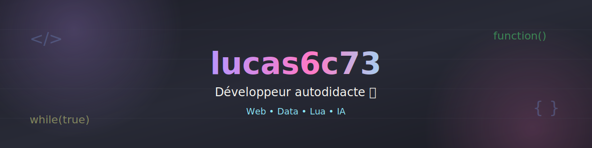

<h1 align="center">Hi 👋, je suis Ton Nom</h1>
<h3 align="center">Namaste 🙏 Bienvenue sur mon profil !</h3>

<!-- Bannière (remplace le lien par ton image hébergée, ex: dans un dossier assets/ de ce repo) -->

  

<h1 align="center">MonPseudo ici 🔥 !</h1>

---

## ⚡ À propos de moi

- ✨ J'ai commencé le développement avec **ASP.NET MVC**
- 🎧 Je fais du Front-end et du Web Design
- 📚 Je poursuis un diplôme en informatique
- 💼 Expérience en .NET Framework et Full Stack
- 💬 Demandez-moi : .NET, Full Stack, Python
- ⚡ Intérêts : IA, Machine Learning, Deep Learning, Data Science

### 🌐 Suivez-moi sur

---

## 🛠️ Langages & outils

---

## ⚡ Statistiques GitHub

  

  

  

---

## 💻 Tech Stack

---

## 🏆 Top dépôt contribué

  

## 💬 Citation aléatoire

  

---

## ☕ Soutenez-moi

---

👀 Vues du profil : 

